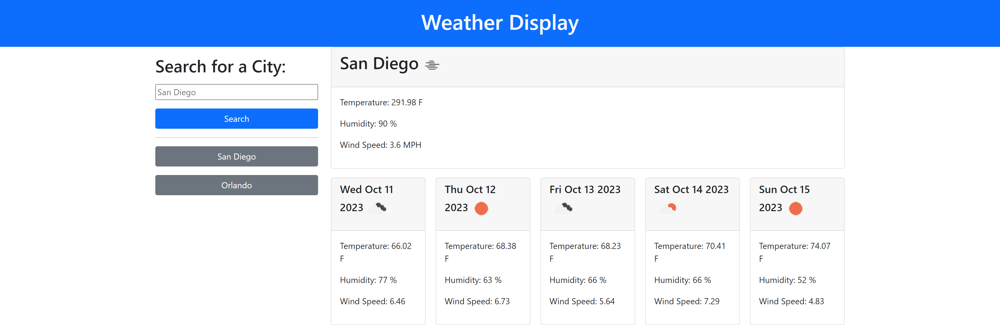

# Weather-Dashboard
## Overview

The purpose of this project is to build a weather dashboard that will run in the browser and feature dynamically updated HTML and CSS. The 5 Day weather forecast API was used to retrieve weather data for cities from https://openweathermap.org/. Additionally, the history of previously searched cities is saved in local storage for persistent data.
- User searches based on city name
- Current weather data and 5 day forecast are displayed for that city, including city name, the date, an icon representation of weather conditions, the temperature, the humidity, and the wind speed
- User may click a previously searched city to display current and forecast weather data
- Weather data for previously searched cities are saved on page reload

## Weather Dashboard Application

## Deployment
See it live at: https://alexlenson.github.io/Weather-Dashboard/

